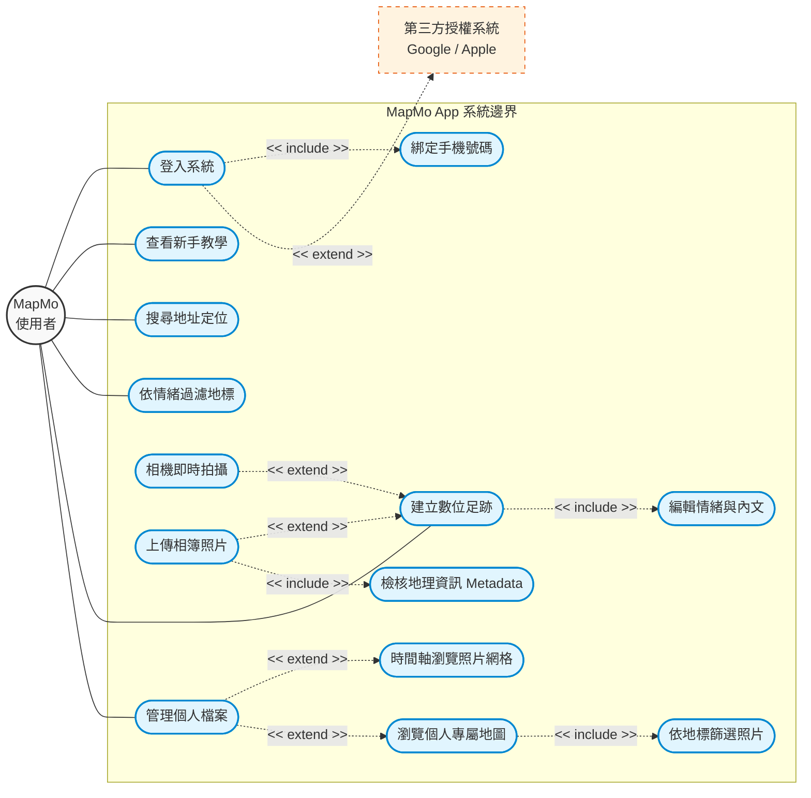
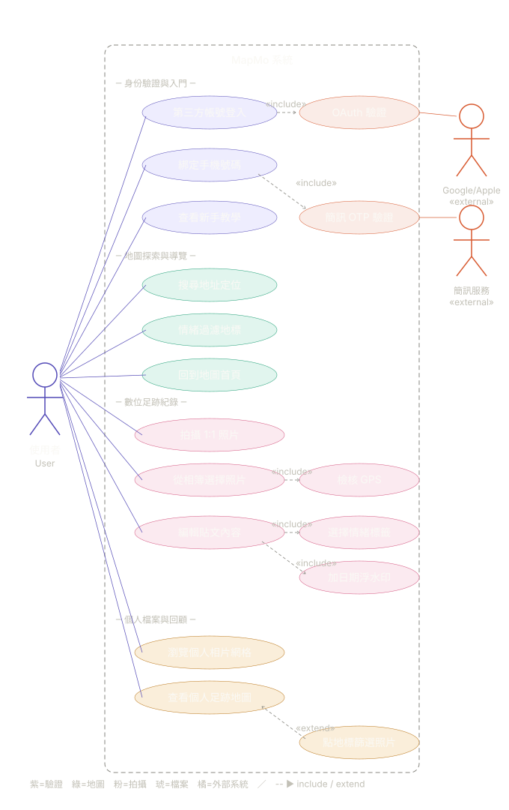

```
請幫我解釋案例圖
是用在網站app系統開發的
```

# Gemini

沒問題！在網站或 App 系統開發的過程中，**案例圖（Use Case Diagram，又稱用例圖）**是非常核心且實用的工具。它是 UML（統一塑模語言）的一種，主要用來描述**「誰」**在使用系統，以及他們可以透過系統**「做什麼事」**。

你可以把案例圖想像成系統的「功能藍圖」或「鳥瞰圖」。它不關心背後的程式碼怎麼寫，也不關心畫面長什麼樣子，只專注於**使用者的行為與系統的功能**。

以下幫你拆解案例圖的核心元素與實際應用：

### 一、 案例圖的四大核心元素

畫案例圖時，通常只會用到以下四個簡單的圖形來表達複雜的系統：

1. **參與者 (Actor)**
* **圖示：** 通常畫成一個「火柴人」。
* **意義：** 代表與系統互動的人或事物。可以是真實的「使用者」（例如：一般會員、管理員），也可以是「外部系統」（例如：第三方支付系統 API、Google 登入服務）。


2. **使用案例 (Use Case)**
* **圖示：** 橢圓形。
* **意義：** 代表系統提供的一個具體功能或目標。命名通常是「動詞＋名詞」，例如：「瀏覽商品」、「加入購物車」、「結帳」。


3. **系統邊界 (System Boundary)**
* **圖示：** 一個大方形框框。
* **意義：** 界定系統的範圍。框框裡面的橢圓形（使用案例）是我們這個 App/網站要開發的功能；框框外面則是參與者（火柴人）。這能幫助團隊明確知道「什麼該做，什麼不歸我們管」。


4. **關聯線 (Relationships)**
* **圖示：** 實線或虛線箭頭。
* **意義：** 連接參與者與使用案例，或使用案例之間的關係。最常見的有三種：
* **一般關聯 (Association)：** 實線，表示參與者可以執行該功能（例如：顧客 — 瀏覽商品）。
* **包含 (Include)：** 虛線箭頭 (`<<include>>`)，表示執行 A 功能時，**一定**會強制執行 B 功能（例如：「結帳」包含「登入/驗證身分」）。
* **擴充 (Extend)：** 虛線箭頭 (`<<extend>>`)，表示執行 A 功能時，**可以選擇性**地觸發 B 功能（例如：「結帳」擴充出「使用折價券」）。


---

### 二、 實際情境範例：開發一款「外送 App」

假設你們團隊正在規劃一款全新的外送 App，案例圖會這樣呈現：

* **系統邊界：** 畫一個大框框，寫上「外送平台系統」。
* **參與者 (框框外)：**
* **顧客**（火柴人）
* **外送員**（火柴人）
* **餐廳端**（火柴人）
* **信用卡金流系統**（外部系統，通常畫成方塊或標註為系統的火柴人）


* **使用案例 (框框內)：**
* 顧客可以連線到：`搜尋餐廳`、`點餐`、`查看訂單狀態`。
* 外送員可以連線到：`接單`、`導航至餐廳`、`確認送達`。
* 其中，`點餐` 這個功能可能會拉一條 `<<include>>` 的虛線到 `線上付款`。
* `線上付款` 則會連線到外部的 **信用卡金流系統**。


---

### 三、 為什麼開發網站 / App 需要畫案例圖？

1. **對焦需求，避免雞同鴨講：** 工程師、設計師 (UI/UX) 和客戶 (或老闆) 懂的語言不同。案例圖是最直觀的圖形，沒有複雜的程式邏輯，所有人都能一眼看懂系統到底要做哪些功能。
2. **釐清開發範圍 (Scope)：** 把系統邊界畫出來後，能清楚知道第一階段 (MVP) 要做哪些功能，避免開發過程中需求無限膨脹（Scope Creep）。
3. **作為 UI/UX 設計的基礎：** 設計師可以根據案例圖上的「動詞」，去規劃 App 需要哪些畫面與操作動線。
4. **作為系統測試的依據：** QA (測試人員) 可以根據每一個「使用案例」來撰寫測試劇本，確保每個功能都能被使用者順利執行。


# Claude

# 案例圖（Use Case Diagram）解釋

案例圖是 UML（統一建模語言）中用來描述系統「**功能需求**」的一種圖。在網站或 App 開發中，它幫助開發團隊與客戶（非技術人員）溝通：**「這個系統會做什麼？誰會用它？」**我先用一個圖示來展示案例圖的基本結構，然後再詳細解釋：## 案例圖的四大元素

**1. 角色（Actor）—— 用「人形圖示」表示**

代表會跟系統互動的「使用者」或「外部系統」。在網站／App 開發中常見的角色：

- 一般使用者、會員、訪客
- 管理員、店家、客服
- 外部系統（金流、簡訊 API、Google 地圖等）

注意：Actor 不一定是「人」，也可以是另一個系統。

**2. 用例（Use Case）—— 用「橢圓」表示**

代表系統提供的一個「功能」或「服務」。命名要用**動詞+名詞**，從使用者角度描述，例如：

- 「註冊帳號」「登入」「忘記密碼」
- 「搜尋商品」「下訂單」「查詢訂單」
- 「發布貼文」「按讚」「留言」

不要寫技術細節（例如「呼叫 API」「寫入資料庫」），那是時序圖或流程圖的工作。

**3. 系統邊界（System Boundary）—— 虛線方框**

把所有用例框起來，框內是「系統要做的事」，框外是「使用者或外部系統」。它清楚劃分**「我們要開發什麼、不開發什麼」**。

**4. 關係（Relationships）—— 連接線**

| 關係 | 表示方式 | 意思 |
|---|---|---|
| 關聯 Association | 實線 | Actor 使用此功能 |
| 包含 Include | 虛線箭頭 + «include» | A 一定會用到 B（例：「下訂單」一定會「線上付款」） |
| 擴充 Extend | 虛線箭頭 + «extend» | A 可能會用到 B（例：「下訂單」有時會「使用優惠券」） |
| 繼承 Generalization | 空心三角箭頭 | 角色或用例的繼承關係（例：VIP會員 繼承 一般會員） |

---

## 在網站/App 開發中的實際用途

**需求階段最重要**——它是 PM、設計師、工程師、客戶之間的「共同語言」：

- **跟客戶確認範圍**：避免做完才被說「我以為還會有 OOO 功能」
- **拆分開發任務**：每個用例就是一個（或多個）功能規格，可以對應到 user story、API 端點、頁面
- **規劃權限**：哪個角色能用哪些功能，一目了然
- **作為測試依據**：每個用例都要有對應的測試案例

## 畫案例圖的小技巧

一是**只畫「做什麼」，不畫「怎麼做」**——「驗證密碼強度」這種細節別放進去。二是**每個用例對使用者都要有實際價值**——「連線到資料庫」不算用例，「查詢訂單」才算。三是**先列 Actor，再列功能**——把每個角色「會在系統中做什麼」逐一寫出，自然就把用例找齊了。四是**控制顆粒度**——一個系統大概 10–25 個主要用例就夠了，太細的拆到子流程或活動圖裡。

常用的繪圖工具：draw.io（免費）、Lucidchart、StarUML、PlantUML（用程式碼產生圖）、Figma 也有 UML 套件。

需要我針對某個具體的網站/App 想法（例如：你正在規劃的某個系統）幫你實際畫一份案例圖嗎？

```
以下是我的 User Story 請幫我先分析再幫我產生案例圖

一、 身份驗證與入門 (Authentication & Onboarding)

作為一個使用者，我想要透過 Google 或 Apple 帳號快速登入 並 綁定手機號碼，好讓我能安全且便利地進入系統 。 

作為一個使用者，我想要在首次登入時查看教學說明，好讓我能快速掌握 APP 的地圖與拍攝操作 。 

作為一個使用者，我希望系統預設進入相機拍攝畫面，好讓我能在第一時間捕捉當下的回憶 。  

二、 地圖探索與導覽 (Map Exploration)

作為一個使用者，我想要在搜尋欄位使用搜尋列輸入地址，好讓我能快速定位到特定的地理位置 。 

作為一個使用者，我想要點選地圖左側的情緒按鈕進行過濾，好讓地標顯示出符合該情緒的色系與照片 。 

作為一個使用者，我想要點選 MapMo 品牌 Logo，好讓我不論在哪個頁面都能立刻回到地圖首頁 。 

三、 數位足跡紀錄 (Uploading & Posting)

作為一個使用者，我想要使用強制 1:1 比例的快門拍攝，好讓我的數位紀錄具備一致的視覺美感 。 

作為一個使用者，我想要從相簿選擇照片並讓系統檢核地理位置資訊 (Metadata)，好讓我的回憶能精確地標註在真實的足跡地圖上 。 

作為一個使用者，我想要在編輯頁面選擇情緒標籤並填寫 100 字以內的內容，好讓這份回憶擁有更深層的情感脈絡 。 

作為一個使用者，我想要照片自動顯示日期浮水印，好讓我能清楚記得這份足跡產生的時間 。 

四、 個人檔案與回顧 (Profile Management)

作為一個使用者，我想要在個人檔案查看由新到舊的照片網格，好讓我能按照時間順序回顧自己的生活足跡 。 

作為一個使用者，我想要在個人檔案看到僅限自己足跡的地圖標記，好讓我能專注於管理私人的數位足跡 。 

作為一個使用者，我想要透過點選地圖地標來篩選特定地點的照片，好讓我能快速回味在該地發生的所有故事 。
```

# Gemini

這份 User Story 非常完整，有明確的動機與目標。在將這些 User Story 轉換為案例圖（Use Case Diagram）之前，我們需要先進行**系統分析**。

在系統設計中，有些 User Story 描述的是「使用者的具體行為」（這會成為案例圖上的橢圓形），而有些則是「系統的商業邏輯、UI/UX 限制或非功能性需求」（這些不會畫成獨立的使用案例，而是作為該功能的規格備註）。

以下我為這份 MapMo 專案的需求進行拆解分析：

### 一、 需求轉換分析與 PRD 規格對應

**1. 身份驗證與入門 (Authentication & Onboarding)**

* **登入與綁定：**「Google/Apple 登入」與「綁定手機」是明確的行為。可以設計為一個核心案例 `登入系統`，並「包含 (Include)」`綁定手機號碼`。Google/Apple 則是作為提供服務的「外部參與者」。
* 教學說明：這是一個獨立行為 `查看新手教學`。
* *UI/UX 狀態（非獨立案例）：*「預設進入相機拍攝畫面」是系統啟動時的預設路由（Routing）與 UI 狀態，在案例圖中通常不會畫出來，而是寫在產品需求文件（PRD）的規格備註中。

**2. 地圖探索與導覽 (Map Exploration)**

* 搜尋定位：這是一個明確的行為 `搜尋地址定位`。
* 情緒過濾：這是一個明確的行為 `依情緒過濾地標`。
* *UI 操作（非獨立案例）：*「點選 Logo 回到首頁」屬於全域的導覽列（Navigation Bar）設計，歸類為介面互動，不需要在案例圖中獨立畫出。

**3. 數位足跡紀錄 (Uploading & Posting)**

* 建立足跡：這是系統最核心的功能。來源有兩種：「相機拍攝」與「上傳照片」。所以會定義一個主案例 `建立數位足跡`，並「擴充 (Extend)」出 `相機即時拍攝` 或 `上傳相簿照片`。
* 檢核 Metadata：當使用者選擇「上傳相簿照片」時，系統必須做這件事，所以是「包含 (Include)」`檢核地理資訊`。
* 編輯內容：這屬於建立足跡過程中的必經步驟，因此「包含 (Include)」`編輯情緒與內文`。
* *系統規則（非獨立案例）：*「強制 1:1 比例」與「自動顯示日期浮水印」屬於影像處理的商業邏輯（Business Rules），會在 PRD 中的 `建立數位足跡` 規格下條列，不畫入案例圖。

**4. 個人檔案與回顧 (Profile Management)**

* 這三個 Story 可以整合為一個大的使用案例 `管理個人檔案`。
* 在該模組下，使用者可以有三種檢視模式：`以時間軸瀏覽照片網格`、`瀏覽個人專屬地圖`。
* 當進入地圖時，還能進一步觸發 `依地標篩選照片`。

---

### 二、 系統參與者與使用案例清單

* **系統邊界：** MapMo 系統
* **主要參與者 (Primary Actor)：** MapMo 使用者
* **外部參與者 (Secondary Actor)：** 第三方授權系統 (Google/Apple)

**核心使用案例 (Use Cases)：**

1. 登入系統 (包含：綁定手機號碼)
2. 查看新手教學
3. 搜尋地址定位
4. 依情緒過濾地標
5. 建立數位足跡 (包含：編輯情緒與內文)
* *延伸方式 A：* 相機即時拍攝
* *延伸方式 B：* 上傳相簿照片 (包含：檢核地理資訊 Metadata)


6. 管理個人檔案
* *延伸檢視 A：* 以時間軸瀏覽照片網格
* *延伸檢視 B：* 瀏覽個人專屬地圖 (包含：依地標篩選照片)


---

### 三、 MapMo 案例圖 (Mermaid 語法)

這份圖表使用 Markdown 支援的 Mermaid 語法繪製。你可以**直接將下方的程式碼區塊複製貼上到 Obsidian** 或任何支援 Mermaid 的筆記軟體中，它會自動渲染成視覺化的 UML 案例圖，非常適合直接放入專案開發的規格文件中。



### 開發與設計上的建議：

在進行 UI/UX 流程圖（Flowchart）繪製時，這張圖可以確保團隊不會漏掉特定的檢查點。例如：負責「數位足跡」模組的設計師，看到圖上的 `<< include >> 檢核地理資訊`，就會知道畫面上必須設計一個「如果照片沒有 GPS 座標時的錯誤提示或手動補救流程」，這能大幅減少開發後期才發現漏掉功能的風險。

# Claude

# MapMo 案例圖分析

我先把 user story 拆解過再畫圖。

## 分析過程

**識別 Actor（角色）**

從這些 user story 看，主要角色只有「使用者」一種（沒提到管理員）。但有兩個重要的**外部系統**會跟 MapMo 互動：

- **使用者（User）** — 主要角色
- **第三方驗證服務**（Google / Apple OAuth）— 外部系統
- **手機簡訊服務**（OTP 驗證）— 外部系統

**用例分組與識別**

我把 12 條 user story 整理成 4 個功能模組，並抽出共用流程（include）和選用流程（extend）：

| 模組 | 主要用例 | 包含/擴充關係 |
|---|---|---|
| 身份驗證 | 第三方登入、綁定手機、查看教學 | 登入 «include» OAuth 驗證、綁定手機 «include» 簡訊驗證 |
| 地圖探索 | 搜尋地址、情緒過濾、回首頁 | — |
| 拍攝紀錄 | 拍照、選相簿照片、編輯貼文 | 編輯 «include» 加情緒標籤、«include» 加浮水印；選相簿 «include» 檢核 metadata |
| 個人檔案 | 瀏覽相片網格、查看個人地圖 | 個人地圖 «extend» 點地標篩選照片 |

**幾個設計決策的說明**

「預設進相機」「1:1 強制比例」「100 字以內」「日期浮水印」這些屬於**功能的規則或限制**，不是獨立用例——我把它們併進對應的主用例裡，避免圖過於瑣碎。

「OAuth 驗證」「簡訊 OTP 驗證」獨立成 include 用例，因為它們是登入流程必經、且涉及外部系統。

「點地標篩選」是 extend 而非 include——使用者可以只是滑動瀏覽地圖，不一定會點地標。## 圖中關係的閱讀順序




**身份驗證流程**：使用者點「第三方帳號登入」→ 系統 include 呼叫 Google/Apple OAuth 驗證 → 接著「綁定手機號碼」→ include 簡訊服務發 OTP → 首次登入時還會看到「新手教學」。

**地圖探索**：三個獨立功能，使用者隨時可進入。「回到地圖首頁」對應的是「點 MapMo Logo」這個 user story——這是個全域的導航行為，故獨立成用例。

**拍攝紀錄的鏈式 include**：
- 「從相簿選擇照片」一定會「檢核 GPS metadata」（沒有 GPS 就不能上傳）
- 「編輯貼文」一定會「選擇情緒標籤」+「加日期浮水印」（兩者皆系統強制行為）
- 「拍攝 1:1 照片」和「從相簿選擇」是**兩個並列的入口**，後續都會走到「編輯貼文」（這層關係如果要更精確，可以再用 generalization，但目前 include 已足夠表達）

**個人檔案的 extend**：「點地標篩選照片」是「查看個人足跡地圖」的可選延伸——使用者可能只是看地圖不互動，所以用 extend 而非 include。

## 給你後續開發的建議

這份案例圖可以直接當成 **MVP scope 的對照清單**：13 個用例 + 2 個外部整合，就是你第一版要交付的全部範圍。建議下一步：

1. 把每個用例展開成 **use case description**（前置條件、主要流程、例外流程）
2. 「編輯貼文」「從相簿選擇」這類複雜流程適合再畫 **activity diagram（活動圖）**補充細節
3. 「OAuth 驗證」「簡訊 OTP」會跨系統，建議畫 **sequence diagram（時序圖）**確認 API 互動

需要我幫你把其中某個用例展開成 use case description 範例，或畫對應的活動圖/時序圖嗎？
